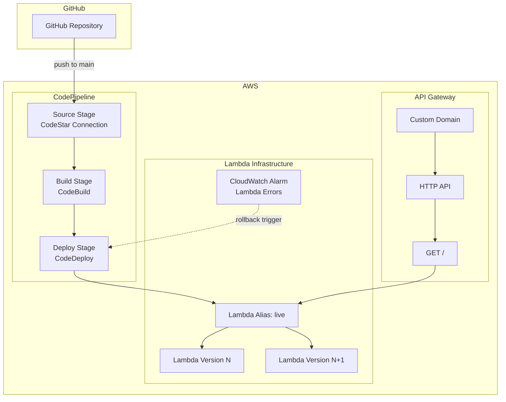

# Design Document

## Overview

This design describes a two-subproject repository demonstrating GitHub-triggered AWS CodePipeline with blue/green deployment of a Lambda function. The CDK subproject defines all infrastructure (pipeline, Lambda, API Gateway, CodeDeploy, custom domain). The Lambda subproject is a self-contained TypeScript application that returns an HTML page with a colored body (blue or green) based on an environment variable.

The pipeline flow is:
1. **Source** — GitHub push to `main` triggers pipeline via CodeStar Connection
2. **Build** — CodeBuild compiles and packages the Lambda TypeScript project
3. **Deploy** — CodeDeploy performs linear 10% per minute traffic shifting through a Lambda alias

### Key Design Decisions

| Decision | Choice | Rationale |
|----------|--------|-----------|
| Language | TypeScript for both subprojects | Consistency, CDK native support |
| CDK version | AWS CDK v2 | Current stable, single-package model |
| Lambda runtime | Node.js 20.x | LTS, TypeScript compiled to JS |
| Build tool (Lambda) | esbuild via CDK bundling or standalone | Fast, tree-shakes dependencies |
| Deployment strategy | CodeDeploy LambdaLinear10PercentEvery1Minute | Meets requirement for gradual traffic shift |
| API Gateway type | HTTP API (API Gateway v2) | Simpler, lower cost, sufficient for proxy integration |
| Package manager | npm | Standard, no extra tooling |

## Architecture



### Repository Layout

```
lambda-blue-green/
├── cdk/                          # CDK subproject
│   ├── package.json
│   ├── tsconfig.json
│   ├── cdk.json
│   ├── bin/
│   │   └── app.ts               # CDK entry point
│   └── lib/
│       ├── pipeline-stack.ts     # CodePipeline + stages
│       └── lambda-stack.ts       # Lambda, API GW, CodeDeploy
├── lambda/                       # Lambda subproject
│   ├── package.json
│   ├── tsconfig.json
│   └── src/
│       └── handler.ts           # Lambda handler
└── README.md
```

## Components and Interfaces

### 1. Lambda Handler (`lambda/src/handler.ts`)

**Responsibility:** Return an HTML page with a colored body based on the `COLOR` environment variable.

**Interface:**
```typescript
// Input: API Gateway Proxy Event (APIGatewayProxyEventV2)
// Output: API Gateway Proxy Result (APIGatewayProxyResultV2)

export const handler = async (event: APIGatewayProxyEventV2): Promise<APIGatewayProxyResultV2> => {
  // ...
};
```

**Behavior:**
- Reads `COLOR` environment variable
- Validates value is `"blue"` or `"green"`
- Returns HTTP 200 with HTML body containing inline CSS `background-color` set to the color value
- Returns HTTP 500 with error message if `COLOR` is missing or invalid
- Includes visible text displaying the current color value

### 2. Lambda Stack (`cdk/lib/lambda-stack.ts`)

**Responsibility:** Define Lambda function, API Gateway HTTP API, custom domain, CodeDeploy application and deployment group, and CloudWatch alarm.

**Resources created:**
- `aws_lambda.Function` — Node.js 20.x, handler bundled from `lambda/` subproject
- `aws_lambda.Alias` — "live" alias used by CodeDeploy for traffic shifting
- `aws_apigatewayv2.HttpApi` — HTTP API with default route proxying to Lambda
- `aws_apigatewayv2.DomainName` — Custom domain with ACM certificate
- `aws_apigatewayv2.ApiMapping` — Maps custom domain to API stage at root path
- `aws_codedeploy.LambdaDeploymentGroup` — Linear10PercentEvery1Minute, references CloudWatch alarm
- `aws_cloudwatch.Alarm` — Monitors Lambda function errors metric

**Parameters (CDK context):**
- `domainName` — Custom domain name (required)
- `certificateArn` — ACM certificate ARN (required)
- `color` — "blue" or "green" (default: "blue")

### 3. Pipeline Stack (`cdk/lib/pipeline-stack.ts`)

**Responsibility:** Define the CodePipeline with source, build, and deploy stages.

**Resources created:**
- `aws_codepipeline.Pipeline` — Three-stage pipeline
- `aws_codestarconnections.CfnConnection` — GitHub connection (or reference existing)
- `aws_codebuild.PipelineProject` — Builds the Lambda subproject
- CodeDeploy deploy action referencing the deployment group from the Lambda stack

**Stage flow:**
1. **Source** — `CodeStarConnectionsSourceAction` watching `main` branch
2. **Build** — `CodeBuildAction` using buildspec that:
   - `cd lambda && npm ci && npm run build`
   - Produces zip artifact
3. **Deploy** — `CodeDeployServerDeployAction` (Lambda blue/green)

### 4. CDK App Entry Point (`cdk/bin/app.ts`)

**Responsibility:** Instantiate stacks, read and validate context parameters.

**Behavior:**
- Reads `domainName`, `certificateArn`, `color` from CDK context
- Fails synthesis with descriptive error if `domainName` or `certificateArn` is missing
- Validates `color` is "blue" or "green"; fails with error if invalid
- Defaults `color` to "blue" if not provided
- Instantiates `LambdaStack` and `PipelineStack`

### 5. Lambda Build Configuration (`lambda/package.json`)

**Scripts:**
- `build` — Compiles TypeScript and produces zip artifact
- `test` — Runs unit tests

**Build output:** `dist/` directory containing compiled JS, then zipped as deployment artifact.

## Data Models

### Lambda Response (Success — HTTP 200)

```typescript
{
  statusCode: 200,
  headers: {
    "Content-Type": "text/html"
  },
  body: `<!DOCTYPE html>
<html>
<head><title>Blue-Green Demo</title></head>
<body style="background-color: ${color};">
  <h1>Current color: ${color}</h1>
</body>
</html>`
}
```

### Lambda Response (Error — HTTP 500)

```typescript
{
  statusCode: 500,
  headers: {
    "Content-Type": "text/html"
  },
  body: `<!DOCTYPE html>
<html>
<head><title>Error</title></head>
<body>
  <h1>Configuration Error</h1>
  <p>Invalid or missing COLOR environment variable. Expected "blue" or "green", got: "${rawValue}"</p>
</body>
</html>`
}
```

### CDK Context Parameters

| Parameter | Type | Required | Default | Validation |
|-----------|------|----------|---------|------------|
| `domainName` | string | Yes | — | Non-empty string |
| `certificateArn` | string | Yes | — | Non-empty string matching `arn:aws:acm:*` pattern |
| `color` | string | No | `"blue"` | Must be `"blue"` or `"green"` |

### CloudFormation Outputs

| Output Key | Value | Purpose |
|------------|-------|---------|
| `ApiGatewayDomainName` | API Gateway regional domain name | For DNS CNAME/alias record configuration |
| `ApiEndpoint` | HTTP API invoke URL | Direct testing endpoint |
| `LambdaFunctionArn` | Lambda function ARN | Reference |


## Correctness Properties

*A property is a characteristic or behavior that should hold true across all valid executions of a system — essentially, a formal statement about what the system should do. Properties serve as the bridge between human-readable specifications and machine-verifiable correctness guarantees.*

*Property-based testing applies to the Lambda handler logic, which is a pure function of its environment variable. The CDK infrastructure is IaC and is tested via CDK snapshot/assertion tests instead.*

### Property 1: Valid color produces correct HTML response

*For any* valid color value (drawn from the set {"blue", "green"}), when the Lambda handler is invoked with that value as the COLOR environment variable, the response SHALL have statusCode 200, a Content-Type header of "text/html", an HTML body with `background-color` set to that color via inline CSS, and visible text displaying that color value.

**Validates: Requirements 5.1, 5.2, 5.3, 5.7**

### Property 2: Invalid or missing color produces error response

*For any* string value that is not "blue" or "green" (including empty string, undefined, whitespace, or arbitrary strings), when the Lambda handler is invoked with that value as the COLOR environment variable (or with no COLOR variable set), the response SHALL have statusCode 500 and a body containing an error message indicating the invalid or missing color configuration.

**Validates: Requirements 5.5, 5.6**

## Error Handling

### Lambda Handler Errors

| Condition | Response | Status Code | Details |
|-----------|----------|-------------|---------|
| COLOR env var missing | Error HTML page | 500 | Message indicates missing variable |
| COLOR env var invalid (not "blue"/"green") | Error HTML page | 500 | Message includes the invalid value received |
| Unhandled exception in handler | API Gateway default error | 502 | Lambda execution failure surfaces as Bad Gateway |

### CDK Synthesis Errors

| Condition | Behavior | Message |
|-----------|----------|---------|
| Missing `domainName` context | Synthesis fails with thrown Error | "Required CDK context parameter 'domainName' is missing" |
| Missing `certificateArn` context | Synthesis fails with thrown Error | "Required CDK context parameter 'certificateArn' is missing" |
| Invalid `color` context value | Synthesis fails with thrown Error | "Color parameter must be 'blue' or 'green', got: '{value}'" |

### Pipeline Error Handling

| Stage | Failure Mode | Behavior |
|-------|-------------|----------|
| Source | Connection unavailable | Stage fails, pipeline stops |
| Source | Repo/branch not found | Stage fails, pipeline stops |
| Build | Compilation error | CodeBuild fails, pipeline transitions to failed state |
| Build | Timeout (>10 min) | CodeBuild fails, pipeline transitions to failed state |
| Deploy | CloudWatch alarm triggers | CodeDeploy rolls back to previous version within 5 minutes |
| Deploy | Deployment failure | Pipeline transitions to failed state |

## Testing Strategy

### Unit Tests (Lambda Handler)

The Lambda handler is the primary unit-testable component. Tests use a mock environment variable and directly invoke the handler function.

**Framework:** Jest (TypeScript)

**Test cases:**
- Handler returns 200 with blue HTML when COLOR="blue"
- Handler returns 200 with green HTML when COLOR="green"
- Handler returns 500 when COLOR is missing
- Handler returns 500 when COLOR is invalid (e.g., "red", "", "BLUE")
- Response Content-Type is always "text/html"
- HTML body contains visible color text

### Property-Based Tests (Lambda Handler)

**Framework:** fast-check (TypeScript PBT library with Jest)

**Configuration:**
- Minimum 100 iterations per property
- Each test tagged with feature and property reference

**Property tests:**
- **Feature: github-codepipeline-blue-green, Property 1: Valid color produces correct HTML response** — Generate valid colors from {"blue", "green"}, invoke handler, assert response structure and content.
- **Feature: github-codepipeline-blue-green, Property 2: Invalid or missing color produces error response** — Generate arbitrary strings (filtered to exclude "blue" and "green"), invoke handler, assert 500 status and error message content.

### CDK Infrastructure Tests (Snapshot/Assertion)

**Framework:** Jest with `aws-cdk-lib/assertions`

**Test cases:**
- Synthesized template contains Lambda function with Node.js 20.x runtime
- Lambda function has COLOR environment variable set
- API Gateway HTTP API exists with route to Lambda
- Custom domain is configured with ACM certificate
- CodeDeploy deployment group uses LambdaLinear10PercentEvery1Minute
- CloudWatch alarm monitors Lambda errors metric
- Pipeline has three stages: Source, Build, Deploy
- IAM policies contain no wildcard actions or resources
- CloudFormation outputs include API Gateway domain name
- Synthesis fails when domainName context is missing
- Synthesis fails when certificateArn context is missing
- Synthesis fails when color is invalid
- Default color is "blue" when not specified

### Integration Tests (Pipeline E2E)

These are manual or CI-triggered tests that verify the full pipeline:
- Push triggers pipeline execution
- Build stage produces Lambda zip artifact
- Deploy stage performs traffic shifting
- Lambda responds correctly via custom domain
- Rollback occurs when alarm triggers during deploy
