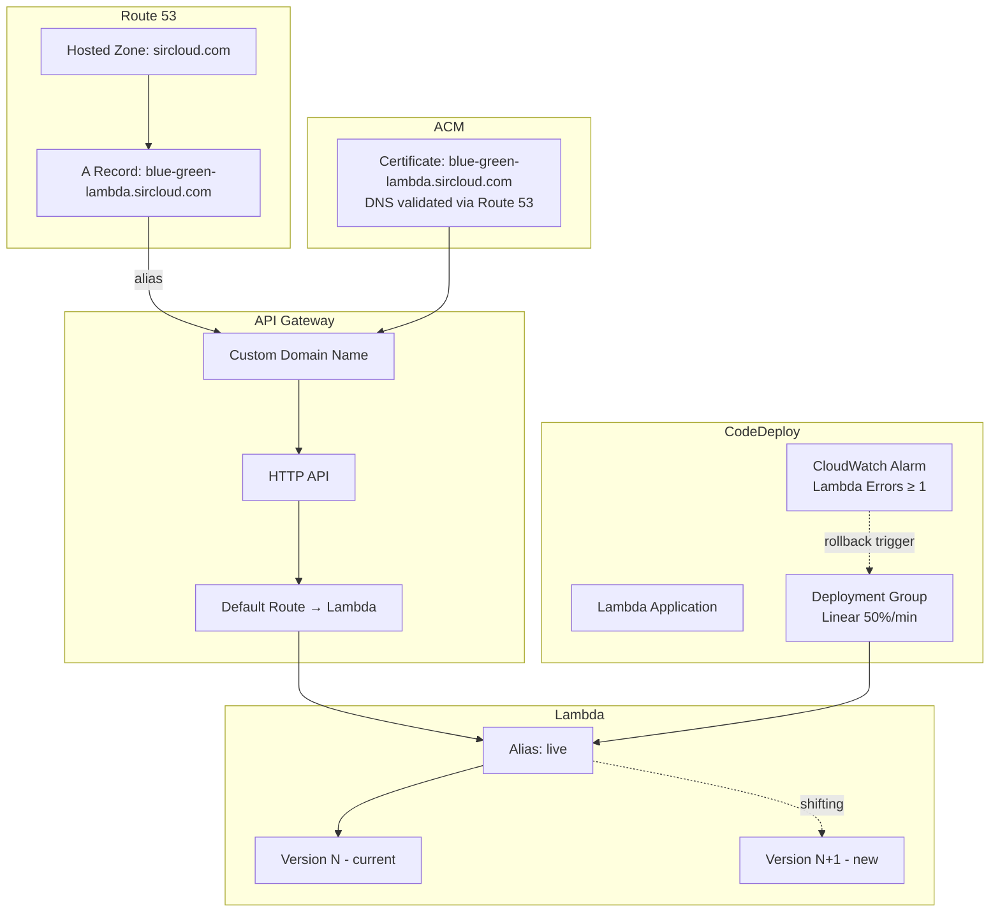
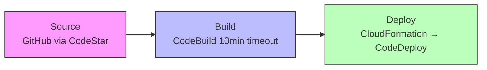
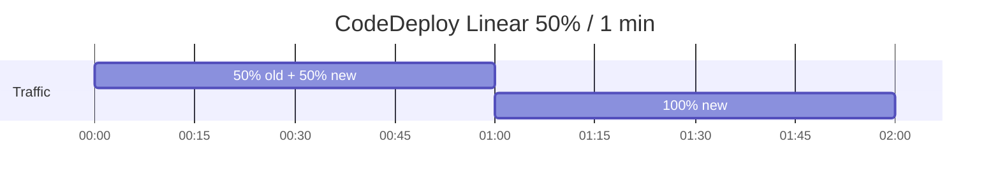

# Lambda Blue/Green Deployment

AWS Lambda blue/green deployment demo using CodePipeline, CodeDeploy, and API Gateway with a custom domain. Push to `main` triggers the pipeline: source → build → deploy with linear 50% traffic shifting per minute.

## Architecture

### High-Level Overview

```mermaid
graph LR
    Developer -->|push to main| GitHub
    GitHub -->|webhook| CodePipeline
    CodePipeline --> CodeBuild
    CodeBuild -->|compiled JS| CodeDeploy
    CodeDeploy -->|traffic shift| Lambda
    Lambda --> API_Gateway[API Gateway HTTP API]
    API_Gateway --> Route53[Route 53]
    Route53 -->|blue-green-lambda.sircloud.com| User
```



### Infrastructure Diagram



### Pipeline Stages



### Traffic Shifting Timeline



## Components

| Component | Description |
|-----------|-------------|
| **Lambda Function** | Returns HTML with background color (blue/green) based on `COLOR` env var. Logs source IP and user-agent. |
| **API Gateway HTTP API** | Proxies all requests to the Lambda alias via custom domain with TLS. |
| **ACM Certificate** | Created by CDK with automatic DNS validation through Route 53. |
| **Route 53** | Alias record pointing custom domain to API Gateway regional endpoint. |
| **CodeDeploy** | Manages blue/green traffic shifting (50%/min) with CloudWatch alarm rollback. |
| **CodePipeline** | Three-stage pipeline (Source → Build → Deploy) triggered by GitHub pushes. |
| **CloudWatch Alarm** | Monitors Lambda errors; triggers automatic rollback during deployment. |

## Project Structure

```
lambda-blue-green/
├── cdk/                        # CDK infrastructure
│   ├── bin/app.ts              # Entry point — validates context, instantiates stacks
│   └── lib/
│       ├── lambda-stack.ts     # Lambda, API GW, Route 53, ACM, CodeDeploy
│       └── pipeline-stack.ts   # CodePipeline (Source/Build/Deploy)
├── lambda/                     # Lambda function
│   └── src/handler.ts          # Handler returning colored HTML
└── README.md
```

## Prerequisites

- Node.js 20+
- AWS CDK CLI (`npm install -g aws-cdk`)
- AWS CLI configured with credentials
- Route 53 hosted zone for your domain (CDK creates the certificate and DNS records automatically)
- GitHub connection in AWS CodeStar Connections (for the pipeline)

## CDK Context Parameters

| Parameter | Required | Default | Description |
|-----------|----------|---------|-------------|
| `domainName` | Yes | — | Custom domain (e.g. `blue-green-lambda.sircloud.com`) |
| `hostedZoneName` | Yes | — | Route 53 hosted zone (e.g. `sircloud.com`) |
| `color` | No | `blue` | Lambda response color (`blue` or `green`) |
| `repositoryOwner` | No | `owner` | GitHub org/user |
| `repositoryName` | No | `lambda-blue-green` | GitHub repo name |
| `connectionArn` | No | auto-created | Existing CodeStar Connection ARN |

## Deploy from Local

### 1. Build the Lambda subproject

```powershell
Set-Location lambda
npm ci
npm run build
Set-Location ..
```

### 2. Install CDK dependencies

```powershell
Set-Location cdk
npm ci
Set-Location ..
```

### 3. Bootstrap CDK (first time only)

```powershell
Set-Location cdk
npx cdk bootstrap
Set-Location ..
```

### 4. Deploy both stacks

```powershell
Set-Location cdk
npx cdk deploy --all `
  --context domainName=blue-green-lambda.sircloud.com `
  --context hostedZoneName=sircloud.com `
  --context color=blue `
  --context repositoryOwner=YOUR_GITHUB_USER `
  --context repositoryName=lambda-blue-green
Set-Location ..
```

CDK will:
- Create an ACM certificate and validate it via Route 53 DNS
- Deploy Lambda, API Gateway, custom domain, and CodeDeploy resources
- Create a Route 53 alias record pointing your domain to API Gateway
- Deploy the CodePipeline with GitHub source integration

### 5. Verify

Open `https://blue-green-lambda.sircloud.com` — you should see a blue page.

## Switch Color (trigger blue/green deployment)

```powershell
Set-Location cdk
npx cdk deploy LambdaStack `
  --context domainName=blue-green-lambda.sircloud.com `
  --context hostedZoneName=sircloud.com `
  --context color=green
Set-Location ..
```

CodeDeploy shifts 50% of traffic after 1 minute, then 100% after 2 minutes. If the CloudWatch alarm fires during shifting, traffic rolls back automatically.

## Useful Commands

```powershell
# Synthesize CloudFormation templates
Set-Location cdk
npx cdk synth --context domainName=blue-green-lambda.sircloud.com --context hostedZoneName=sircloud.com

# Diff changes before deploying
npx cdk diff --all --context domainName=blue-green-lambda.sircloud.com --context hostedZoneName=sircloud.com

# Destroy all stacks
npx cdk destroy --all --context domainName=blue-green-lambda.sircloud.com --context hostedZoneName=sircloud.com
Set-Location ..
```

## Deployment Strategy

**Linear 50% every 1 minute** — CodeDeploy shifts 50% of traffic to the new Lambda version after 1 minute, then completes full cutover at 2 minutes. A CloudWatch alarm monitoring Lambda function errors triggers automatic rollback if issues are detected during the traffic shift.
